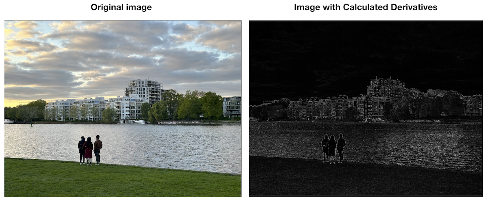
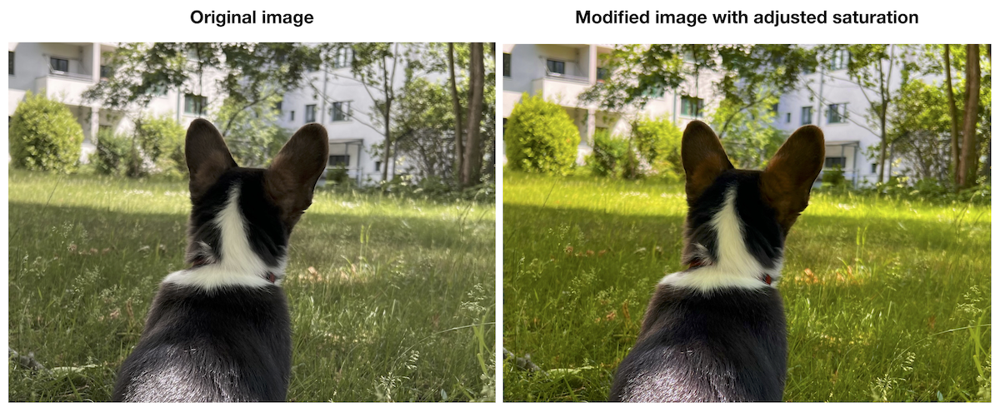

# MetalCustomShaders

MetalCustomShaders is a repository containing custom Metal shaders for image processing and filtering. These shaders leverage the power of Metal, Apple's low-level graphics and compute API, to perform various operations on images such as grayscale conversion, edge detection, and saturation adjustment.

## Medium Article

To gain a comprehensive understanding of the concepts and techniques covered in this repository, make sure to check out the accompanying Medium article titled ["Building Custom Shaders with Metal"](https://medium.com/@JustRouzbeh/building-custom-shaders-with-metal-854aae65458). In this article, the process of crafting and utilizing custom shaders using Metal is explored in detail. It provides step-by-step guidance, explanations, and practical examples to help you grasp the core concepts and techniques involved.

## Repository Images

In this repository, you will find the following images that demonstrate the output of the custom Metal shaders:

This image showcases the output of the image derivatives operation performed using a custom Metal shader. The derivatives are calculated for each pixel in the image, highlighting the edges and providing valuable information for edge detection and image segmentation.

This image demonstrates the effect of the saturation adjustment operation achieved using a custom Metal shader. By modifying the saturation of the colors in an image, this operation allows for vibrant or desaturated visual effects, providing greater control over the image's color intensity.
